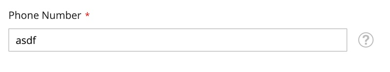
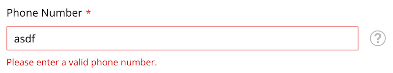

## 📋 Description

Problem: Magento 2 allows invalid characters in the phone number field:

<table>
  <tr>
    <td><strong>Fresh Magento 2 installation:</strong><br></td>
    <td><strong>Validation with Module:</strong><br></td>
  </tr>
</table>

This module adds phone number validation to key Magento 2 forms such as:

- 🛒 Checkout (shipping & billing address)
- 🧑 during Customer registration (todo)

---

## 📦 Installation (via Composer Path Repository)

1. Install via composer(recommended)

```bash
composer require matusstafura/magento2-phone-validation  
````

or clone this module to `app/code/MatusStafura/PhoneValidation`:

```bash
git clone git@github.com:matusstafura/magento2-phone-validation.git 
````

2. Enable and compile module:

```bash
bin/magento module:enable MatusStafura_PhoneValidation
bin/magento setup:upgrade
bin/magento setup:di:compile
bin/magento cache:flush
```

3. Enable / disable in Admin:

Stores > Configuration > Customers > Customer Configuration > Phone Validation

---

## 🤝 Contributing

Contributions are very welcome! If you'd like to improve the module, add features, fix bugs, or improve documentation:

1. Fork the repository
2. Create a new branch:
```bash
  git checkout -b feature/your-feature-name
```
3. Make your changes and commit with clear messages
4. Push to your fork:
```bash
  git push origin feature/your-feature-name
```
5. Open a pull request on GitHub

---

## 📃 License

MIT

---

## Support

[](https://www.buymeacoffee.com/matusstafura)

